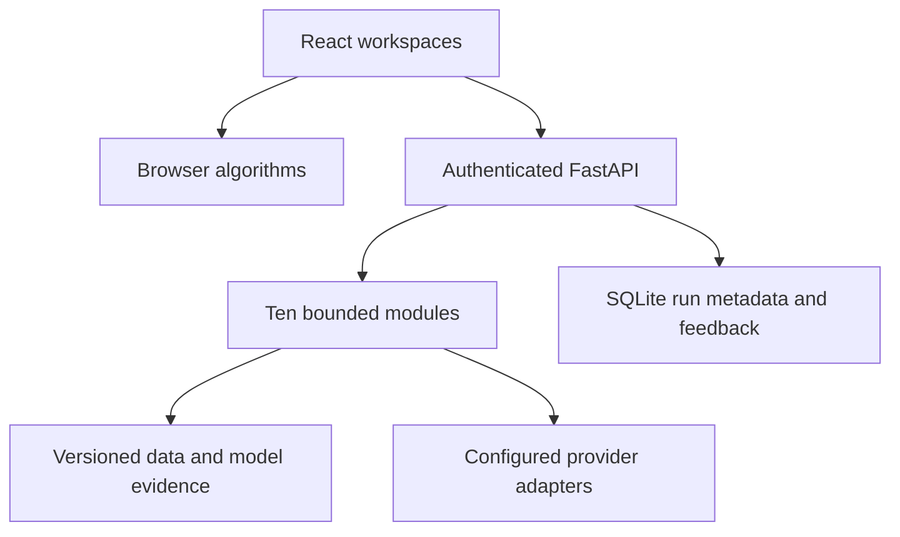

# Muhammad Ali Hussain AI Engineering Studio

Ten AI-assisted engineering prototypes with a React/TypeScript explorer, Python/FastAPI services, real local algorithms, tests, versioned evidence and provider adapters. This collection replaces the earlier public project gallery. It is a learning and engineering portfolio, not a claim of production deployment for every live AI capability.

## Explore

Public workspaces: https://muhammad-ali-hussain-engineering.muhammadalifarhanhus.chatgpt.site/projects/

| Project | Working local implementation | Optional/configured capability |
|---|---|---|
| Atlas RAG | PDF page extraction, BM25/hash-vector fusion, exact citations, retrieval metrics | Learned embeddings, cross-encoder, model synthesis |
| Scout Search | Explicit fixture retrieval and source citations | Brave live search/fetch, provider planning/synthesis |
| Pulse Voice | Browser capture/VAD/playback and ordered session engine | Actual STT → model → TTS via server adapters |
| Prism Multimodal | File metadata, code AST inspection, SHA-256 evidence | Image reasoning/audio transcription and synthesis |
| Review Swarm | AST/static checks and test-plan findings | Three model roles and bounded syntax-gated revision proposals |
| DomainLab | Trained SQL-intent classifier, saved weights, held-out evaluation | Optional Hugging Face causal-LM training script (unrun) |
| Guardrail Lab | Synthetic injection and PII suite with per-case scores | Bounded configured-model canary probes |
| QueryLens | CSV aggregate grammar, restricted SQLite execution, chart data | Provider language-to-SQL drafting |
| ContextBridge MCP | Real SDK stdio server/client and allowlisted tools | Operator connection to a compatible MCP client |
| Portfolio Copilot | Career-only excerpt retrieval and source references | Provider synthesis and opt-in backend feedback |

## Run locally

Python 3.12 and Node 22.18+ are recommended. From this directory:

```bash
python -m venv .venv
. .venv/bin/activate
pip install -r backend/requirements.txt
export PYTHONPATH="$PWD/backend"
export STUDIO_API_TOKEN="$(python -c 'import secrets; print(secrets.token_urlsafe(32))')"
uvicorn studio.app:app --host 127.0.0.1 --port 8000
```

In another terminal, `cd frontend && npm ci && npm run dev`. Open the interface and connect to the localhost API using the backend token. The token is held in page memory; do not use a provider API key as that token. The public static website can run its browser-local tools without this setup. Its full Python services do not run in static hosting.

For optional live calls, set `OPENAI_API_KEY` and `OPENAI_MODEL` on the backend only. Choose a Responses-compatible model available to your account. Set `BRAVE_SEARCH_API_KEY` for live search. Speech uses `OPENAI_STT_MODEL` and `OPENAI_TTS_MODEL`; defaults are in `.env.example`. Environment files are not loaded automatically: export values in your shell or use your deployment's secret mechanism. Provider requests consume your own quota. No credentials, paid calls or live benchmarks are bundled.

For learned retrieval/reranking install `sentence-transformers` separately and cache operator-selected models as described in [RAG notes](docs/rag.md). Large-model training requires optional torch/transformers and a configured model path; it has not been run. The supplied completed adaptation is a TF-IDF/SGD classifier with fixed SQL templates.

## Verify and reproduce

Recorded local validation: 156 backend tests and 27 frontend checks passed, including ten React workspace runs and parity with all 128 held-out classifier predictions. The per-case reports are in artifacts/verification. These are local checks, not claims of a successful live-provider deployment.

```bash
PYTHONPATH=backend python -m unittest discover -s tests -v
python training/train_sql_intent.py
python training/benchmark_safety.py
cd frontend && npm test && npm run build
```

The trained classifier scored 107/128 (83.59%) on a synthetic held-out test, versus 85/128 (66.41%) for its generic base classifier and 106/128 (82.81%) for SQL-only training. Inspect `artifacts/model/evaluation.json`, dataset split groups and per-case predictions. This is not a benchmark of generative SQL models or real enterprise data. Rerunning training regenerates its artifacts; numerical library versions are pinned.

Provider tests use explicit test doubles and mock HTTP transports; they do not establish end-to-end live service performance. MCP tests start a real child process and negotiate the actual protocol. Voice tests deliberately interrupt different provider stages and check that stale results never become current.

## Architecture



The API binds to localhost by default. Configure `STUDIO_ALLOWED_ORIGINS` for a trusted frontend. SSE communicates workflow events; it is not described as token streaming. Voice can use WebSockets with the API token in the first message. Sessions are process-local, so run one worker for the included prototype.

## Limits and provenance

This work was implemented with AI assistance. Inspect source and understand the design before using its claims in an interview. No previous employment, real-user count, safety guarantee, enterprise-scale benchmark or trained language-model checkpoint is invented. Static preview inputs stay in the browser until a visitor explicitly connects a backend. Backend metrics store run metadata; feedback stores only what a visitor explicitly submits. Review proposals are not executed or merged.

Each project has [technical notes](docs/) explaining its implemented scope, tests and missing operational pieces. The source is intended to be run and extended; production use requires workload testing, deployment-level controls and configured external services.
